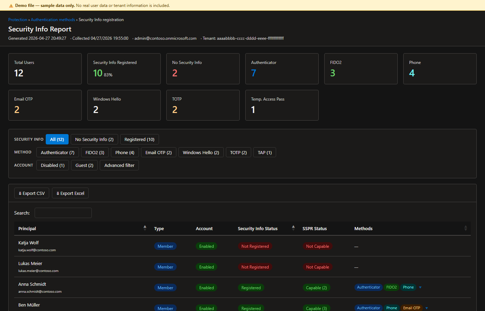

# Entra Security Info Report

> PowerShell script that queries Microsoft Graph for every user's registered authentication methods and generates a self-contained, filterable HTML report — including Security Info registration status, SSPR capability, and per-method detail.

**Author:** Matthias Scharl — Security Cloud Solution Architect at Microsoft

> ⚠️ **Personal project disclaimer**
> This is a **personal project** and is not an official Microsoft product, solution, or service.
> It is not endorsed, supported, or maintained by Microsoft Corporation.
> The views and tooling presented here are those of the author alone and do not represent Microsoft's official guidance.
> Use at your own risk — see the [Disclaimer](#disclaimer) section for full terms.

Scripts were created with the assistance of **GitHub Copilot (Claude Sonnet 4.6)**, personally tested by the author, and published in line with [Microsoft's Responsible AI principles](https://www.microsoft.com/en-us/ai/responsible-ai).

---

## Overview

> **Live demo:** Open the [interactive demo report](https://matthiasscharl.github.io/Demos/Entra/SecurityInfo-Report/SecurityInfoReport-demo.html) in a browser to see the report in action with sample data — no PowerShell or tenant connection required.



Understanding which authentication methods your users have enrolled — and whether those methods qualify for Self-Service Password Reset (SSPR) — is a core identity security posture task. This solution solves that by:

1. **Collecting** per-user authentication method data from Microsoft Graph (read-only).
2. **Generating** a self-contained HTML report with summary cards, quick filters, an advanced identity filter, and a searchable, exportable table.
3. **Persisting** a JSON snapshot alongside the HTML, allowing the report to be regenerated at any time without re-querying the tenant.

```
Connect to Graph ──► Enumerate users ──► Collect auth methods (parallel)
                                                      │
                             ┌────────────────────────┴─────────────────────────┐
                             │                                                   │
                    JSON snapshot (Report/)                          HTML report (Report/)
                                                                           │
                                              ┌────────────────────────────────────────────┐
                                              │  Summary cards  │  Quick filters  │  Table  │
                                              │  Adv. filter    │  SSPR status    │  Export │
                                              └────────────────────────────────────────────┘
```

### Report columns

| Column | Description |
|---|---|
| **Principal** | Display name + UPN |
| **Type** | Member / Guest |
| **Account** | Enabled / Disabled |
| **Security Info Status** | Whether the user has any Security Info method registered |
| **SSPR Status** | Count of SSPR-capable methods; expands to show which methods qualify on row click |
| **Methods** | All registered methods as chips; expands to device/detail level on row click |

### SSPR-capable methods

Per [Microsoft Docs](https://learn.microsoft.com/en-us/entra/identity/authentication/overview-authentication#authentication-methods-supported-by-microsoft-entra-id):

| Method | SSPR capable |
|---|---|
| Microsoft Authenticator (push / OTP) | ✅ |
| Phone (SMS / Voice call) | ✅ |
| Email OTP | ✅ |
| Software OATH / TOTP | ✅ |
| FIDO2 / Passkey | ❌ MFA only |
| Windows Hello for Business | ❌ MFA only |
| Temporary Access Pass | ❌ MFA only |

### Method detail available per type

| Method | API detail |
|---|---|
| **Microsoft Authenticator** | Device name, push vs. passwordless phone sign-in mode |
| **Software OATH / TOTP** | Registration only — specific app not identifiable via API |
| **FIDO2 Security Key** | Key display name, AAGUID → mapped to vendor/model (YubiKey, Feitian, etc.) |
| **Phone (SMS / Voice)** | Phone number, type (mobile / alt-mobile / office), SMS sign-in state |
| **Email OTP** | Email address |
| **Windows Hello for Business** | Device name |
| **Temporary Access Pass** | Usability status, lifetime in minutes |
| **Password** | Presence only (not counted as a Security Info method) |

---

## Security Notes

- The script is **read-only** — no changes are made to the tenant or user accounts.
- Authentication uses **delegated (interactive) sign-in** via `Connect-MgGraph`. No credentials or secrets are stored or logged.
- The minimum required role is **Authentication Administrator** — not Global Administrator (Zero Trust / least-privilege principle).
- The HTML report and JSON snapshot contain user UPNs, account status, and enrolled method details — treat them as sensitive data and store accordingly.
- Reports are saved to a `Report/` subfolder which is gitignored to prevent accidental commit of tenant data.

---

## Prerequisites

| Requirement | Notes |
|---|---|
| PowerShell 7.2+ | `#Requires -Version 7.2` |
| `Microsoft.Graph.Authentication` module | `Install-Module Microsoft.Graph.Authentication` |
| Entra RBAC | **Authentication Administrator** or **Global Reader** |
| Graph permissions | `UserAuthenticationMethod.Read.All`, `User.Read.All` (delegated) |
| Internet access (report only) | CDN for Bootstrap 5 and DataTables (loaded at report view time) |

> The script automatically installs `Microsoft.Graph.Authentication` from PSGallery if it is not already present — no manual installation required.

---

## Workflow

```
Step 1  ──  Run the script (interactive browser login is prompted automatically)
            .\Get-SecurityInfoReport.ps1
            → outputs Report\SecurityInfoReport-<timestamp>.json
            → outputs Report\SecurityInfoReport-<timestamp>.html
            → opens the report in the default browser

Step 2  ──  (Optional) Regenerate HTML from a saved JSON snapshot
            .\Get-SecurityInfoReport.ps1 -JsonPath '.\Report\SecurityInfoReport-<timestamp>.json'
            → reads the JSON, skips Graph, writes a new HTML
```

The JSON snapshot can be archived and re-used to regenerate the report with a different title or output path at any time without re-querying the tenant.

---

## Scripts

### `Get-SecurityInfoReport.ps1`

Single script that covers both collect and report-generation modes.

```powershell
# Collect from the signed-in account's tenant and open the report
.\Get-SecurityInfoReport.ps1

# Specific tenant, exclude guest and disabled accounts
.\Get-SecurityInfoReport.ps1 -TenantId '<tenant-id>' -ExcludeGuestUsers -ExcludeDisabledAccounts

# Suppress browser open (e.g. scheduled / unattended run)
.\Get-SecurityInfoReport.ps1 -NoOpen

# Custom report title
.\Get-SecurityInfoReport.ps1 -Title 'Contoso — Security Info Posture'

# Regenerate HTML from a saved JSON snapshot (no Graph connection needed)
.\Get-SecurityInfoReport.ps1 -JsonPath '.\Report\SecurityInfoReport-20260427-120000.json'

# Regenerate with custom title and output path
.\Get-SecurityInfoReport.ps1 -JsonPath '.\Report\SecurityInfoReport-20260427-120000.json' `
                              -Title 'Contoso — Security Info Posture' `
                              -OutputPath 'C:\Reports\securityinfo-report.html'
```

**Parameters:**

| Parameter | Mode | Description |
|---|---|---|
| `-TenantId` | Collect | Entra tenant GUID. Omit to use the identity picker. |
| `-ExcludeGuestUsers` | Collect | Exclude guest accounts. |
| `-ExcludeDisabledAccounts` | Collect | Exclude disabled accounts. |
| `-ThrottleLimit` | Collect | Parallel Graph threads (1–50, default 20). |
| `-JsonPath` | Report | Path to an existing JSON snapshot. Skips Graph collection. |
| `-Title` | Both | Report title shown in header and browser tab. Default: `Security Info Report`. |
| `-OutputPath` | Both | Folder or `.html` path for the report. Default: `Report\` subfolder. |
| `-NoOpen` | Both | Suppress auto-opening the report in the browser. |

**Report features:**
- **Summary cards**: total users, Security Info registered %, no-Security-Info count, per-method-type counts.
- **Quick filters**: All, No Security Info, Registered, and one button per method type (Authenticator, FIDO2, Phone, Email OTP, etc.).
- **Advanced identity filter**: multi-condition filter with free-text match (UPN / display name), Include / Exclude toggle per row, AND / OR connector between rows. Panel clears when closed.
- **Security Info Status column**: `Registered` / `Not Registered` pill per user.
- **SSPR Status column**: `Capable (N)` or `Not Capable` pill. Click any row to expand and see which specific methods count towards SSPR.
- **Methods column**: method chips expand on row click to show device names, phone numbers, FIDO2 vendor/model, and other per-method detail.
- **Export**: CSV and Excel via DataTables Buttons.
- **Dark mode**: full Fluent UI dark theme via `@media (prefers-color-scheme: dark)`.
- **Self-contained output**: HTML references CDN assets only; JSON snapshot is saved separately for re-use.

---

### `Entra-Helpers.psm1`

Shared helper module imported automatically by `Get-SecurityInfoReport.ps1`. Not intended to be called directly.

Exports: `Write-Step`, `Write-Success`, `Write-Warn`, `Initialize-GraphSession`, `Invoke-GraphPagedRequest`.

---

## References

- [Authentication methods supported by Microsoft Entra ID](https://learn.microsoft.com/en-us/entra/identity/authentication/overview-authentication#authentication-methods-supported-by-microsoft-entra-id)
- [SSPR authentication methods](https://learn.microsoft.com/en-us/entra/identity/authentication/concept-sspr-howitworks#authentication-methods)
- [Microsoft Graph authentication methods API](https://learn.microsoft.com/en-us/graph/api/authentication-list-methods)
- [User.Read.All permission](https://learn.microsoft.com/en-us/graph/permissions-reference#userreadall)
- [UserAuthenticationMethod.Read.All permission](https://learn.microsoft.com/en-us/graph/permissions-reference#userauthenticationmethodreadall)
- [FIDO2 hardware vendor list (AAGUID)](https://learn.microsoft.com/en-us/entra/identity/authentication/concept-fido2-hardware-vendor)
- [Authentication Administrator role](https://learn.microsoft.com/en-us/entra/identity/role-based-access-control/permissions-reference#authentication-administrator)

---

## Disclaimer

This toolset is provided **"AS IS"** for informational and guidance purposes only. You are solely responsible for reviewing, testing, and ensuring compliance with your organisation's security and data handling policies before use in production. See the disclaimer header in each script file for full terms.
